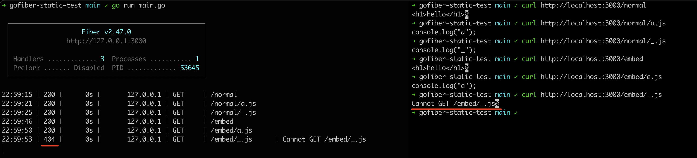

# gofiber-static-test

Serve embed static files by `filesystem` and `http.FS(frontend)` problem.

Underscore `_` in filename is `404`.



## fix

```go
// change
//go:embed all:public

// to
//go:embed public
```
